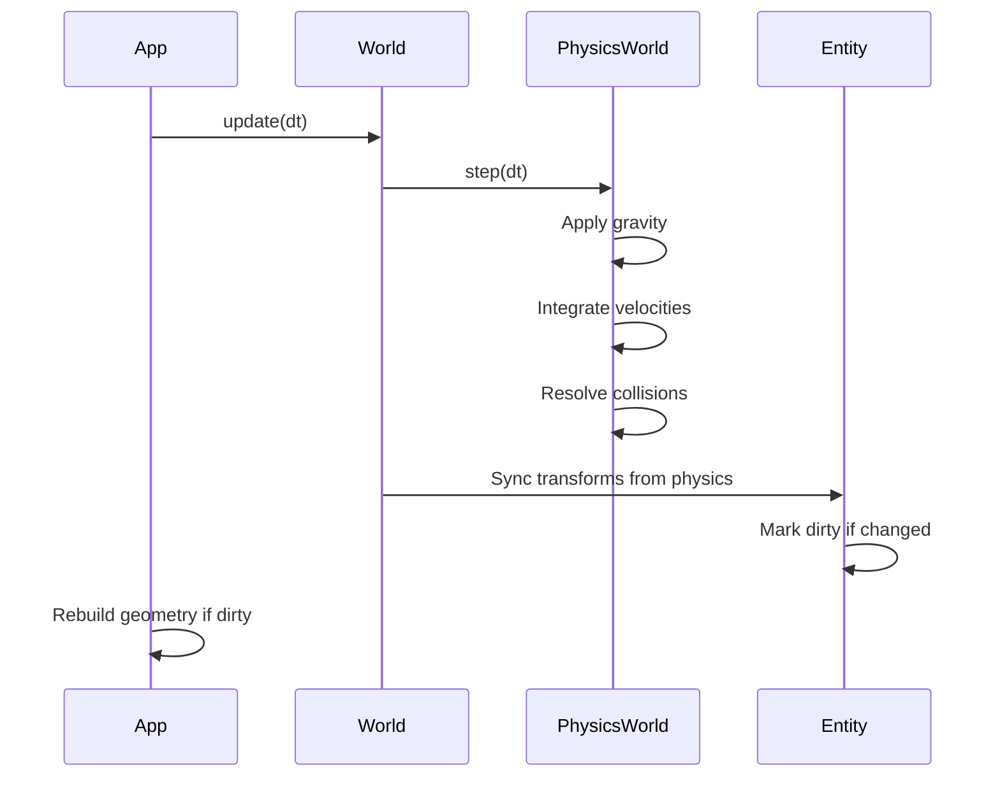

# Rust4D Architecture

This document describes the architecture of Rust4D, a 4D rendering engine written in Rust.

## Crate Structure

Rust4D is organized as a Cargo workspace with specialized crates. Each crate has a single responsibility, enabling parallel development and clean dependency management.

### Crate Descriptions

| Crate | Purpose |
|-------|---------|
| **rust4d_math** | 4D vector (`Vec4`) and matrix math. No dependencies on other crates. |
| **rust4d_core** | Core types: `World`, `Entity`, `Transform4D`, shapes (`Tesseract4D`, `Hyperplane4D`). Depends on math and physics. |
| **rust4d_render** | GPU rendering: `RenderContext`, `SlicePipeline`, `RenderPipeline`, `Camera4D`. Uses wgpu for GPU access. |
| **rust4d_physics** | 4D physics simulation: `PhysicsWorld`, `RigidBody4D`, collision detection. |
| **rust4d_input** | Input handling: `CameraController` for FPS-style 4D navigation. |
| **rust4d** | Main application that ties everything together. |

## Data Flow

The engine follows a clear data flow from user input to screen output:

### Data Flow Steps

1. **User Input**: Keyboard, mouse, and gamepad events from winit
2. **CameraController**: Translates raw input into camera movements and physics commands
3. **Camera4D**: Maintains 4D position and orientation, computes view parameters
4. **PhysicsWorld**: Simulates 4D physics, applies gravity, resolves collisions
5. **World**: Container for all entities, syncs transforms from physics
6. **RenderableGeometry**: CPU-side geometry converted from World entities
7. **SlicePipeline**: GPU compute shader that slices 4D tetrahedra into 3D triangles
8. **RenderPipeline**: GPU render pipeline that draws 3D triangles to screen

## Rendering Pipeline

The heart of Rust4D is the 4D-to-3D slicing pipeline. This happens in two GPU passes:

### Rendering Steps

1. **4D Tetrahedra**: All 4D geometry is tessellated into 4-simplices (tetrahedra in 4D, each with 5 vertices)

2. **Hyperplane Slicing**: A compute shader intersects each tetrahedron with a 3D hyperplane at the camera's W position. This produces 0, 3, or 4 vertices per tetrahedron (triangles or quads).

3. **3D Triangles**: The intersection produces standard 3D triangles with positions, normals, and colors

4. **Vertex Processing**: Standard 3D vertex shader applies view and projection matrices

5. **Fragment Shading**: Per-pixel lighting with ambient/diffuse components, plus W-based color tinting

### Why Tetrahedra?

Just as 3D meshes are made of triangles (2-simplices), 4D meshes are made of tetrahedra (3-simplices in 4D space, also called pentachorons or 5-cells). When you slice a tetrahedron with a hyperplane, you get either:
- Nothing (hyperplane misses it)
- A triangle (3 intersection points)
- A quadrilateral (4 intersection points, rendered as 2 triangles)

## Physics Integration

Physics simulation runs on the CPU and updates entity transforms each frame:

### Physics Features

- **4D Gravity**: Configurable gravity along any axis (default: -Y)
- **AABB Colliders**: Axis-aligned bounding boxes in 4D
- **Static Colliders**: Floors and walls that don't move
- **Rigid Bodies**: Dynamic bodies with mass, velocity, and material properties
- **Physics Materials**: Restitution (bounciness) and friction coefficients

## Camera System

The camera operates in 4D space with both 3D and 4D controls:

### Camera Modes

1. **Free Look** (cursor captured): Mouse directly rotates camera
2. **Click-Drag**: Left-click and drag to rotate
3. **W-Rotation**: Right-click and drag to rotate in 4D planes

## Configuration System

Configuration uses a layered approach with figment:

### Configuration Layers

1. **default.toml**: Base configuration, checked into git
2. **user.toml**: Personal overrides, gitignored
3. **Environment**: `R4D_SECTION__KEY` format for runtime overrides

Priority: Environment > user.toml > default.toml

## Entity-Component Pattern

Entities use a simplified component pattern (not full ECS):

### Key Design Decisions

- **SlotMap for Entities**: Stable keys, efficient iteration, safe removal
- **Optional Physics**: Entities can exist without physics bodies
- **Dirty Flags**: Avoid rebuilding GPU geometry every frame
- **Tags**: Simple string-based filtering (e.g., "dynamic", "static")

## GPU Buffer Layout

The rendering pipeline uses several GPU buffers:

| Buffer | Type | Contents |
|--------|------|----------|
| Vertex Buffer | Storage | 4D vertices with position, color |
| Tetrahedra Buffer | Storage | Indices into vertex buffer (5 per tetrahedron) |
| Output Buffer | Storage | 3D triangles from slicing (written by compute) |
| Counter Buffer | Storage | Atomic counter for triangle count |
| Indirect Buffer | Indirect | Draw parameters for indirect rendering |
| Uniform Buffer | Uniform | Camera matrices, lighting parameters |

### Indirect Rendering

The compute shader writes an unknown number of triangles. We use indirect rendering to avoid CPU readback:

1. Compute shader increments atomic counter for each triangle
2. Copy counter to indirect draw buffer
3. Render pass uses indirect draw with triangle count from buffer

## Future Architecture Considerations

Areas planned for expansion:

- **Scene Graph**: Hierarchical transforms for complex objects
- **Multiple Render Passes**: Shadow mapping, post-processing
- **Instancing**: Efficient rendering of repeated geometry
- **Async Asset Loading**: Non-blocking resource loading
- **Audio Integration**: Spatial audio in 4D
