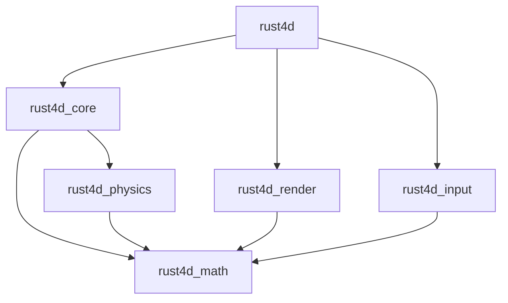
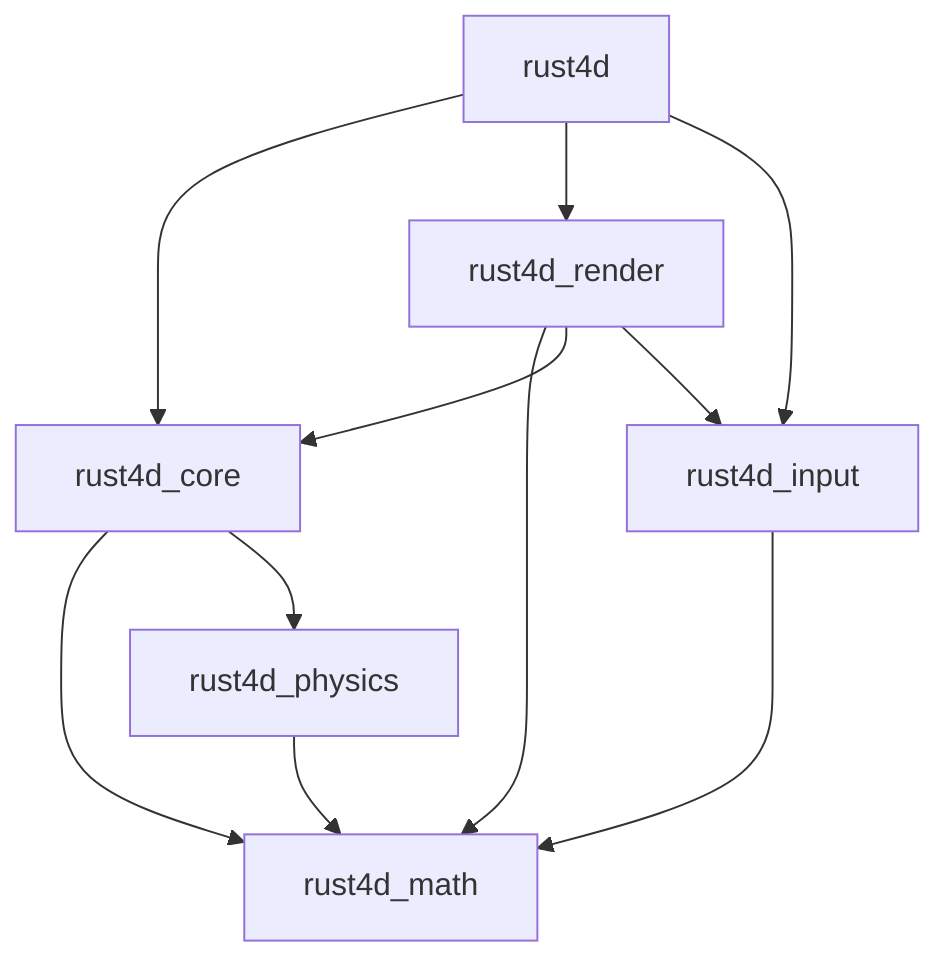

# Wave 4: Documentation Updates

**Effort**: 0.5 sessions
**Priority**: LOW
**Dependencies**: Waves 1-3 complete (document final state)

---

## Overview

Update documentation to accurately reflect the codebase state after cleanup. This includes roadmap status, README claims, and architecture diagrams.

---

## Task 1: Update Roadmap Phase Status

**Priority**: MEDIUM
**Effort**: 10 minutes
**Files**: `scratchpad/plans/engine-roadmap-2026/00-index.md`

### Problem
The roadmap index shows Phase 3B (Comprehensive Guides) as "NOT STARTED" but the `docs/` directory has all 4 guides complete.

### Fix
Update the status table in `00-index.md`:

```markdown
| Phase | Status |
|-------|--------|
| Phase 1A: Scene Serialization | COMPLETE |
| Phase 1B: Configuration System | COMPLETE |
| Phase 2A: Scene Manager | COMPLETE |
| Phase 2B: Prefab System | COMPLETE (via EntityTemplate) |
| Phase 3A: Examples + ARCHITECTURE | COMPLETE |
| Phase 3B: Comprehensive Guides | COMPLETE |
| Phase 4: Architecture Refactoring | NOT STARTED |
| Phase 5: Advanced Features | NOT STARTED |
```

### Also Update
- Add note that Prefab system was implemented as EntityTemplate (simpler approach)
- Remove any references to ColliderTemplate (never implemented)

---

## Task 2: Update README.md Status

**Priority**: MEDIUM
**Effort**: 10 minutes
**Files**: `README.md`

### Problem
README lists "Scene serialization" under "What's in progress" but it's fully functional.

### Fix

Move from "in progress" to "What works":

```markdown
## What Works

- 4D shape rendering (tesseract, hyperplanes)
- Real-time 3D slicing of 4D geometry
- First-person 4D camera with full rotation
- Physics simulation with 4D collision detection
- Scene serialization and loading (RON format)  <!-- MOVE HERE -->
- Configuration system (TOML)
- 4 working examples

## What's in Progress

- Audio integration
- More 4D primitives
```

### Also Consider
- Update any version numbers if applicable
- Verify all "What Works" items actually work after cleanup
- Remove any claims about features that were removed

---

## Task 3: Update ARCHITECTURE.md

**Priority**: LOW
**Effort**: 15 minutes
**Files**: `ARCHITECTURE.md`

### Problem
The dependency diagram doesn't show `rust4d_render -> rust4d_input` dependency.

### Current Diagram (Incomplete)


### Corrected Diagram


### Additional Updates
- Note that `rust4d_render` depends on `rust4d_input` for the `CameraControl` trait
- Add note about potential future refactor to move trait elsewhere
- Update any references to removed code (Simplex4D, PlayerPhysics, etc.)

---

## Task 4: Update Phase Plans with Completion Notes

**Priority**: LOW
**Effort**: 15 minutes
**Files**: Various phase plan files

### Updates Needed

1. **phase-2-scene-management.md**:
   - Add completion note that Prefab system was implemented as EntityTemplate
   - Note that override support was descoped
   - Mark Phase 2B as complete with simplified approach

2. **phase-1-foundation.md**:
   - Remove or strike through ColliderTemplate references (never implemented)
   - Add note that colliders are created from entity tags instead

3. **phase-3-documentation.md**:
   - Mark Phase 3B as complete
   - List the created documentation files

### Format for Completion Notes
```markdown
---
**COMPLETION NOTE (2026-01-28)**: This phase was completed with the following differences from the original plan:
- Feature X was implemented as Y instead
- Feature Z was descoped because [reason]
---
```

---

## Task 5: Clean Up Scratchpad Archive

**Priority**: LOW
**Effort**: 10 minutes
**Files**: `scratchpad/archive/`

### Actions
- Move any outdated plans that reference removed features to archive
- Ensure current plans in `scratchpad/plans/` are accurate
- Add README to archive explaining what's there

---

## Checklist

- [ ] Update Phase 3B status to COMPLETE in roadmap index
- [ ] Add note about EntityTemplate as prefab solution
- [ ] Move "Scene serialization" to "What Works" in README
- [ ] Verify all README claims are accurate
- [ ] Update ARCHITECTURE.md dependency diagram
- [ ] Add render->input dependency note
- [ ] Add completion notes to phase-2 plan
- [ ] Remove/update ColliderTemplate references in phase-1
- [ ] Mark phase-3 as complete
- [ ] Review and organize scratchpad archive

---

## Commits

1. `Update roadmap to reflect Phase 3B completion`
2. `Update README with accurate feature status`
3. `Fix ARCHITECTURE.md dependency diagram`
4. `Add completion notes to phase plans`

---

## Verification

After all updates:
```bash
# Check no references to removed code in docs
grep -r "PlayerPhysics" docs/ README.md ARCHITECTURE.md
grep -r "Simplex4D" docs/ README.md ARCHITECTURE.md
grep -r "slice.wgsl" docs/ README.md ARCHITECTURE.md

# Should return nothing
```

---

## Notes

This wave should be done LAST because:
1. Waves 1-3 may change what's accurate
2. Documentation should reflect the final cleaned-up state
3. Any additional issues found during cleanup should be documented here
