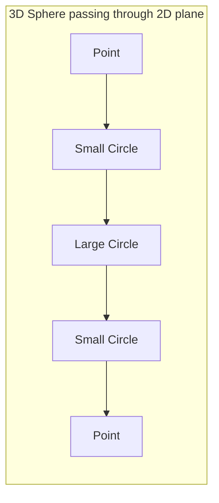
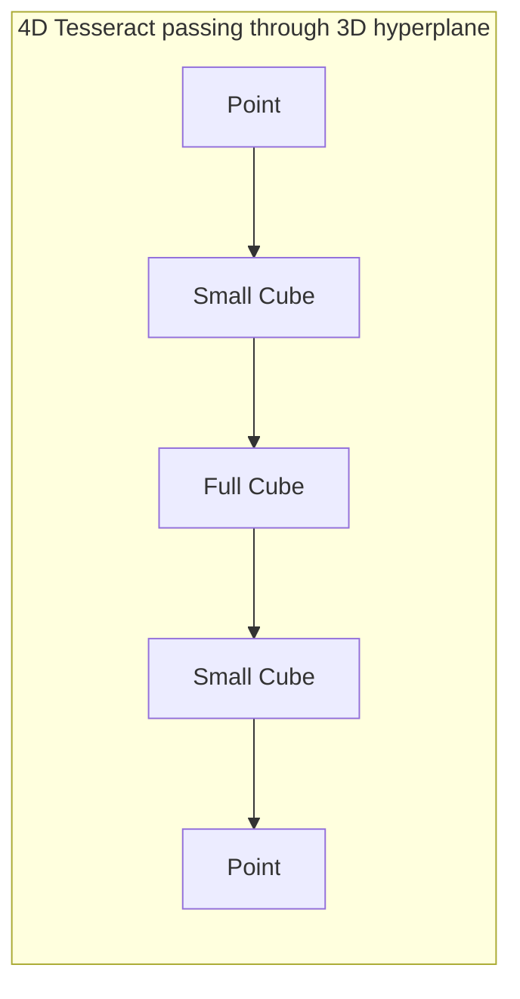

# Getting Started with Rust4D

Welcome to Rust4D, a 4D rendering engine written in Rust. This guide will take you from
installation to creating your first 4D scene.

## Table of Contents

1. [Introduction](#introduction)
2. [Prerequisites](#prerequisites)
3. [Installation](#installation)
4. [Building and Running](#building-and-running)
5. [Understanding 4D Space](#understanding-4d-space)
6. [Running the Examples](#running-the-examples)
7. [Your First 4D Scene](#your-first-4d-scene)
8. [Next Steps](#next-steps)

---

## Introduction

### What is Rust4D?

Rust4D displays real-time 3D cross-sections of 4D geometry. Just as a 3D object passing
through a 2D plane creates a 2D cross-section, Rust4D slices 4D objects with a 3D
hyperplane to produce the 3D shapes you see on screen.

The engine includes:

- **True 4D geometry**: Mathematical primitives defined in 4-dimensional space
- **GPU-accelerated slicing**: Compute shaders that slice 4D tetrahedra in parallel
- **4D physics**: Gravity, collision detection, and rigid body dynamics in 4D
- **FPS-style controls**: Navigate 4D space with intuitive keyboard and mouse controls

### What You Will Learn

By the end of this guide, you will understand:

- How to set up your development environment
- The basic concepts of 4D space and 4D rendering
- How to run the included examples
- How to create a simple 4D scene from scratch

---

## Prerequisites

### Rust Knowledge

This guide assumes basic familiarity with Rust and Cargo. If you are new to Rust,
work through [The Rust Book](https://doc.rust-lang.org/book/) first.

### Hardware Requirements

Rust4D uses [wgpu](https://wgpu.rs/) for GPU access, requiring support for:

- **Vulkan** (Linux, Windows)
- **Metal** (macOS)
- **DirectX 12** (Windows)

Most GPUs from the last 10 years will work.

### Software Requirements

- **Rust 1.70 or later**
- **A C compiler**: Visual Studio Build Tools (Windows), Xcode CLI tools (macOS),
  or GCC/Clang (Linux)

---

## Installation

### Step 1: Install Rust

If Rust is not installed, use rustup:

```bash
curl --proto '=https' --tlsv1.2 -sSf https://sh.rustup.rs | sh
```

Verify installation:

```bash
rustc --version
cargo --version
```

### Step 2: Clone the Repository

```bash
git clone https://github.com/yourusername/rust4d
cd rust4d
```

### Step 3: Verify GPU Support

```bash
cargo run --example 01_hello_tesseract --release
```

If you see a window with an orange shape, your environment is ready.

### Linux-Specific Setup

On Linux, install Vulkan support:

```bash
# Debian/Ubuntu
sudo apt install libvulkan1 vulkan-tools

# Fedora
sudo dnf install vulkan-loader vulkan-tools

# Arch Linux
sudo pacman -S vulkan-icd-loader vulkan-tools
```

---

## Building and Running

### Running the Main Application

```bash
cargo run --release
```

Always use `--release` mode for interactive use.

### What You Should See

A window displays geometric shapes - these are 3D cross-sections of 4D objects.
As you move along the W-axis, shapes change in ways impossible for true 3D objects.

### Controls Overview

| Input | Action |
|-------|--------|
| WASD | Move in XZ plane |
| Q / E | Move along W-axis (4th dimension) |
| Space / Shift | Move up/down |
| Mouse | Look around |
| Right-click drag | Rotate through W |
| Scroll wheel | Adjust slice offset |
| R | Reset camera |
| F | Fullscreen |
| Escape | Release cursor / Quit |

Click to capture the mouse cursor; press Escape to release.

### Configuration

Configuration loads from TOML files with environment variable overrides:

```bash
R4D_WINDOW__TITLE="My 4D Game" cargo run --release
R4D_PHYSICS__GRAVITY="-10.0" cargo run --release
```

### Troubleshooting

**"No suitable GPU adapter found"**: Update graphics drivers or ensure Vulkan/Metal/DX12 support.

**Compilation errors**: Install C development tools (build-essential on Linux, Xcode CLI on macOS).

**Low frame rate**: Use `--release` mode and ensure your discrete GPU is being used.

---

## Understanding 4D Space

### What is the 4th Dimension?

In Rust4D, the 4th dimension is a **spatial** dimension, not time. We add a fourth
perpendicular axis called W to the familiar X, Y, Z.

### The Flatland Analogy

Imagine a 2D being living on a flat plane. If a 3D sphere passes through their plane,
they see a circle that appears, grows, shrinks, and vanishes - 2D cross-sections of
a 3D object.



Rust4D does this one dimension higher: we see 3D cross-sections of 4D objects.



### The W-Axis

The W-axis is perpendicular to X, Y, and Z. In Rust4D:

- **Q key** moves toward +W (called "ana")
- **E key** moves toward -W (called "kata")

### Why Objects "Morph"

Moving along W shows different cross-sections. A tesseract (4D cube) appears as a cube,
then complex polyhedra, then another cube as you move through it.

### Objects Can Pass "Through" Each Other

Two objects at the same X, Y, Z but different W positions do not collide - they are
separated in the 4th dimension.

---

## Running the Examples

### Example List

| Example | Description | Key Concepts |
|---------|-------------|--------------|
| 01_hello_tesseract | Minimal 4D rendering | World, Entity, Camera4D |
| 02_multiple_shapes | Multiple objects | Transform4D, Material, input |
| 03_physics_demo | Physics simulation | PhysicsConfig, RigidBody4D |
| 04_camera_exploration | Full controls | CameraController, mouse look |

### Running Examples

```bash
cargo run --example 01_hello_tesseract --release
cargo run --example 02_multiple_shapes --release
cargo run --example 03_physics_demo --release
cargo run --example 04_camera_exploration --release
```

### Learning Path

1. **01_hello_tesseract** - Basic render pipeline
2. **02_multiple_shapes** - Transforms and materials
3. **03_physics_demo** - Physics integration
4. **04_camera_exploration** - Full control scheme

### Example Walkthrough: 01_hello_tesseract

The minimal example creates a single tesseract:

```rust
use rust4d_core::{Entity, Material, ShapeRef, Tesseract4D, World};
use rust4d_render::{camera4d::Camera4D, RenderableGeometry};
use rust4d_math::Vec4;

// Create a world
let mut world = World::new();

// Create a tesseract with size 2.0
let tesseract = Tesseract4D::new(2.0);

// Add an entity with orange material
let entity = Entity::with_material(
    ShapeRef::shared(tesseract),
    Material::from_rgb(0.8, 0.4, 0.2),
);
world.add_entity(entity);

// Convert to GPU geometry
let geometry = RenderableGeometry::from_world(&world);

// Set up camera
let mut camera = Camera4D::new();
camera.position = Vec4::new(0.0, 2.0, 6.0, 0.0);
```

---

## Your First 4D Scene

Let us create a scene with tesseracts at different W positions.

### Step 1: Imports

```rust
use std::sync::Arc;
use winit::{
    application::ApplicationHandler,
    event::WindowEvent,
    event_loop::{ActiveEventLoop, ControlFlow, EventLoop},
    window::{Window, WindowId},
};

use rust4d_core::{Entity, Material, ShapeRef, Tesseract4D, Transform4D, World};
use rust4d_render::{
    camera4d::Camera4D,
    context::RenderContext,
    pipeline::{perspective_matrix, RenderPipeline, RenderUniforms, SliceParams, SlicePipeline},
    RenderableGeometry,
};
use rust4d_math::Vec4;
```

### Step 2: Application State

```rust
struct MyApp {
    window: Option<Arc<Window>>,
    render_context: Option<RenderContext>,
    slice_pipeline: Option<SlicePipeline>,
    render_pipeline: Option<RenderPipeline>,
    world: World,
    geometry: RenderableGeometry,
    camera: Camera4D,
}
```

### Step 3: Initialize the World

```rust
impl MyApp {
    fn new() -> Self {
        let mut world = World::new();

        // Tesseract at origin (visible at W=0)
        let origin = Tesseract4D::new(1.5);
        world.add_entity(Entity::with_material(
            ShapeRef::shared(origin),
            Material::from_rgb(0.9, 0.3, 0.2),
        ));

        // Tesseract at W=+2 (press Q to find it)
        let w_positive = Tesseract4D::new(1.5);
        let transform_wp = Transform4D::from_position(Vec4::new(3.0, 0.0, 0.0, 2.0));
        world.add_entity(Entity::with_transform(
            ShapeRef::shared(w_positive),
            transform_wp,
            Material::from_rgb(0.2, 0.9, 0.3),
        ));

        // Tesseract at W=-2 (press E to find it)
        let w_negative = Tesseract4D::new(1.5);
        let transform_wn = Transform4D::from_position(Vec4::new(-3.0, 0.0, 0.0, -2.0));
        world.add_entity(Entity::with_transform(
            ShapeRef::shared(w_negative),
            transform_wn,
            Material::from_rgb(0.2, 0.3, 0.9),
        ));

        let geometry = RenderableGeometry::from_world(&world);

        let mut camera = Camera4D::new();
        camera.position = Vec4::new(0.0, 2.0, 8.0, 0.0);

        Self {
            window: None,
            render_context: None,
            slice_pipeline: None,
            render_pipeline: None,
            world,
            geometry,
            camera,
        }
    }
}
```

### Step 4: Window Setup

```rust
impl ApplicationHandler for MyApp {
    fn resumed(&mut self, event_loop: &ActiveEventLoop) {
        if self.window.is_none() {
            let window = Arc::new(
                event_loop
                    .create_window(
                        Window::default_attributes()
                            .with_title("My First 4D Scene")
                            .with_inner_size(winit::dpi::LogicalSize::new(1024, 768)),
                    )
                    .expect("Failed to create window"),
            );

            let render_context = pollster::block_on(RenderContext::new(window.clone()));
            let mut slice_pipeline = SlicePipeline::new(&render_context.device);
            let mut render_pipeline = RenderPipeline::new(
                &render_context.device,
                render_context.config.format,
            );

            render_pipeline.ensure_depth_texture(
                &render_context.device,
                render_context.size.width,
                render_context.size.height,
            );

            slice_pipeline.upload_tetrahedra(
                &render_context.device,
                &self.geometry.vertices,
                &self.geometry.tetrahedra,
            );

            self.window = Some(window);
            self.render_context = Some(render_context);
            self.slice_pipeline = Some(slice_pipeline);
            self.render_pipeline = Some(render_pipeline);
        }
    }

    fn window_event(&mut self, event_loop: &ActiveEventLoop, _id: WindowId, event: WindowEvent) {
        match event {
            WindowEvent::CloseRequested => event_loop.exit(),
            WindowEvent::Resized(size) => {
                if let Some(ctx) = &mut self.render_context {
                    ctx.resize(size);
                }
                if let (Some(ctx), Some(rp)) = (&self.render_context, &mut self.render_pipeline) {
                    rp.ensure_depth_texture(&ctx.device, size.width, size.height);
                }
            }
            WindowEvent::RedrawRequested => {
                self.render_frame();
                if let Some(w) = &self.window {
                    w.request_redraw();
                }
            }
            _ => {}
        }
    }
}
```

### Step 5: Render Loop

```rust
impl MyApp {
    fn render_frame(&self) {
        let (Some(ctx), Some(sp), Some(rp)) = (
            &self.render_context,
            &self.slice_pipeline,
            &self.render_pipeline,
        ) else { return };

        let pos = self.camera.position;
        let slice_params = SliceParams {
            slice_w: self.camera.get_slice_w(),
            tetrahedron_count: self.geometry.tetrahedron_count() as u32,
            _padding: [0.0; 2],
            camera_matrix: self.camera.rotation_matrix(),
            camera_eye: [pos.x, pos.y, pos.z],
            _padding2: 0.0,
            camera_position: [pos.x, pos.y, pos.z, pos.w],
        };
        sp.update_params(&ctx.queue, &slice_params);

        let render_uniforms = RenderUniforms {
            view_matrix: [[1.0, 0.0, 0.0, 0.0], [0.0, 1.0, 0.0, 0.0],
                          [0.0, 0.0, 1.0, 0.0], [0.0, 0.0, 0.0, 1.0]],
            projection_matrix: perspective_matrix(
                std::f32::consts::FRAC_PI_4, ctx.aspect_ratio(), 0.1, 100.0,
            ),
            light_dir: [0.5, 1.0, 0.3],
            _padding: 0.0,
            ambient_strength: 0.3,
            diffuse_strength: 0.7,
            w_color_strength: 0.5,
            w_range: 2.0,
        };
        rp.update_uniforms(&ctx.queue, &render_uniforms);

        let output = match ctx.surface.get_current_texture() {
            Ok(o) => o,
            Err(_) => return,
        };
        let view = output.texture.create_view(&wgpu::TextureViewDescriptor::default());
        let mut encoder = ctx.device.create_command_encoder(
            &wgpu::CommandEncoderDescriptor { label: None },
        );

        sp.reset_counter(&ctx.queue);
        sp.run_slice_pass(&mut encoder);
        rp.prepare_indirect_draw(&mut encoder, sp.counter_buffer());
        rp.render(&mut encoder, &view, sp.output_buffer(),
            wgpu::Color { r: 0.02, g: 0.02, b: 0.08, a: 1.0 });

        ctx.queue.submit(std::iter::once(encoder.finish()));
        output.present();
    }
}
```

### Step 6: Main Function

```rust
fn main() {
    env_logger::init();
    let event_loop = EventLoop::new().expect("Failed to create event loop");
    event_loop.set_control_flow(ControlFlow::Poll);
    let mut app = MyApp::new();
    event_loop.run_app(&mut app).expect("Event loop error");
}
```

### Running Your Scene

```bash
cargo run --example my_first_scene --release
```

You will see a red tesseract at W=0. The green (W=+2) and blue (W=-2) tesseracts
are invisible until you add input handling to move along the W-axis.

---

## Next Steps

### Read the Documentation

- [User Guide](user-guide.md) - Comprehensive feature documentation
- [Developer Guide](developer-guide.md) - Contributing and extending Rust4D
- [Architecture Guide](../ARCHITECTURE.md) - System design and data flow

### Experiment

- Work through all four examples in order
- Modify example 03 to experiment with physics
- Add keyboard input to your scene (see example 02)

### Inspiration

- [4D Golf](https://store.steampowered.com/app/2147950/4D_Golf/)
- [4D Toys](http://4dtoys.com/)
- [Miegakure](https://miegakure.com/)
- [Engine4D](https://github.com/HackerPoet/Engine4D)

---

## Quick Reference

### Common Types

| Type | Description |
|------|-------------|
| `World` | Container for all entities |
| `Entity` | Object with shape, transform, material |
| `Transform4D` | Position, rotation, scale in 4D |
| `Vec4` | 4D vector (x, y, z, w) |
| `Camera4D` | Viewpoint for rendering |
| `Tesseract4D` | 4D hypercube primitive |
| `Hyperplane4D` | 4D floor/surface primitive |

### Crates

| Crate | Purpose |
|-------|---------|
| `rust4d_math` | 4D vector and matrix math |
| `rust4d_core` | World, entities, transforms, shapes |
| `rust4d_render` | GPU rendering pipeline |
| `rust4d_physics` | 4D physics simulation |
| `rust4d_input` | Input handling and camera |

---

Happy exploring in 4D space!
