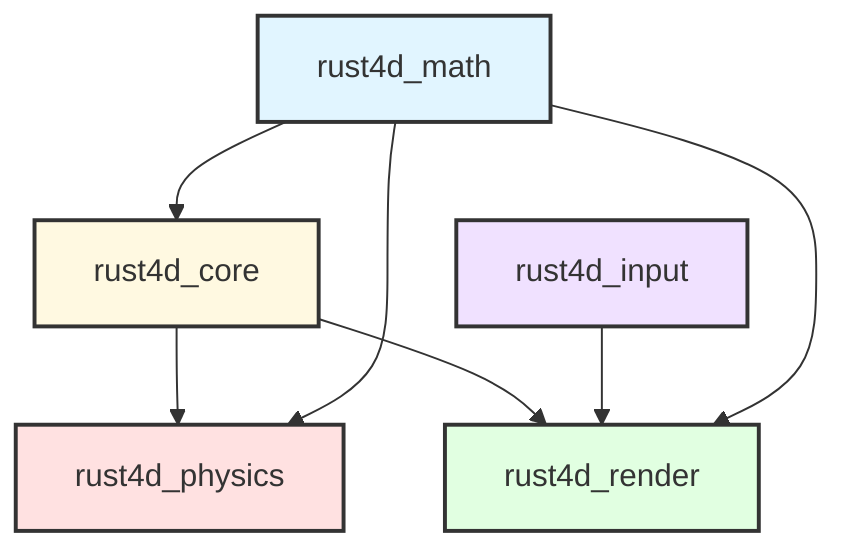
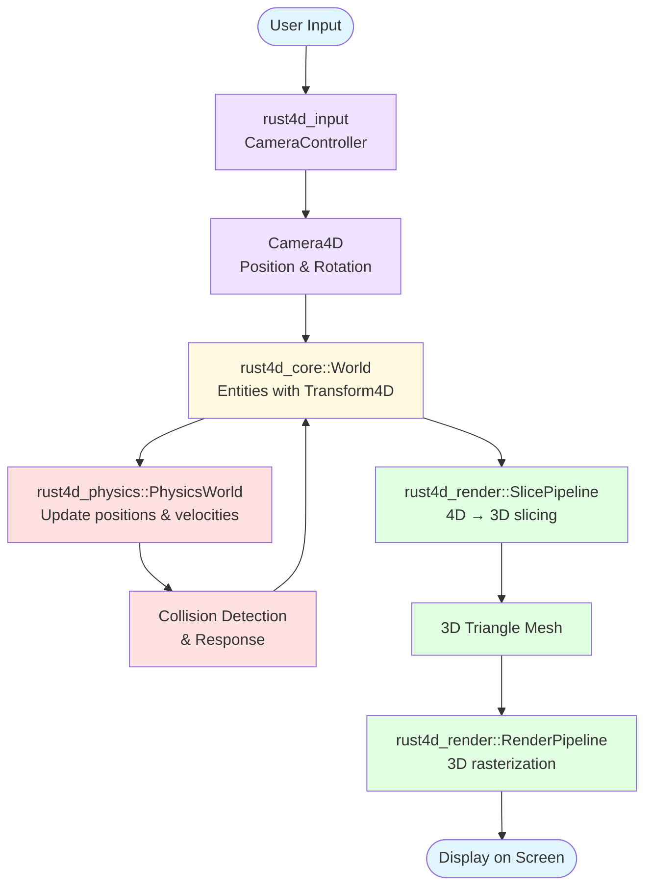
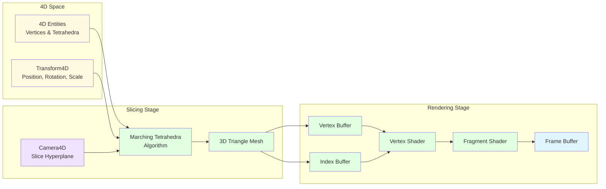
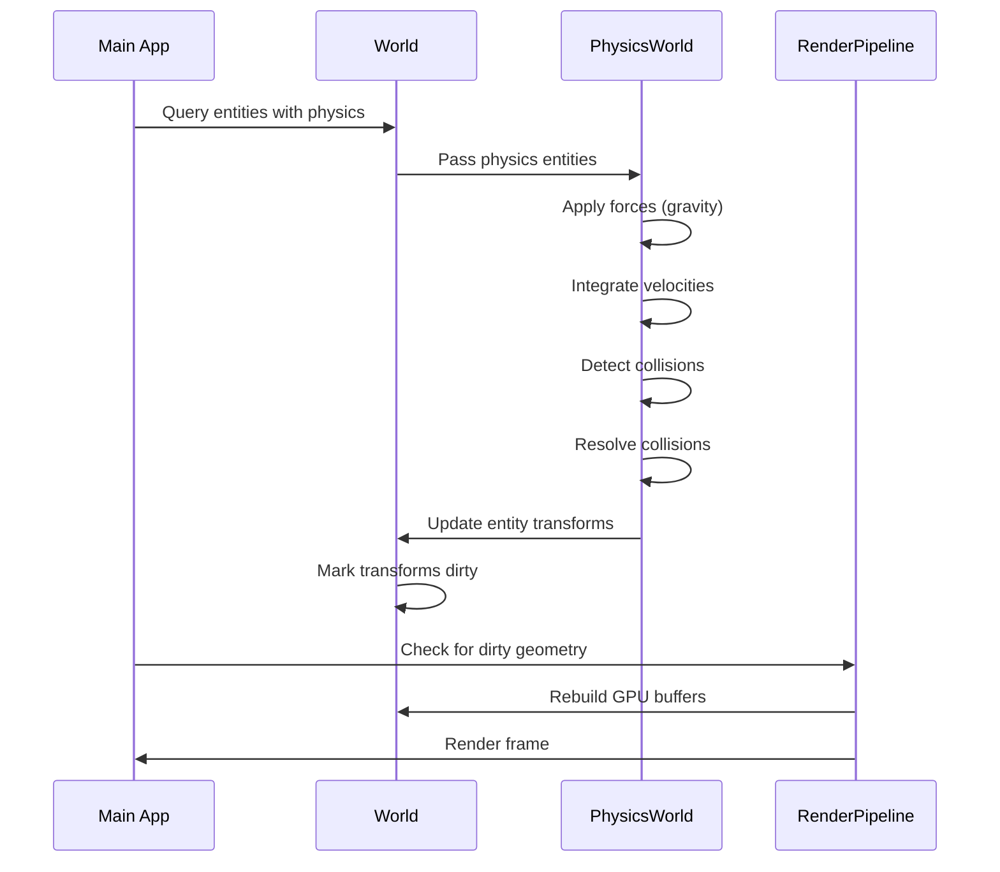
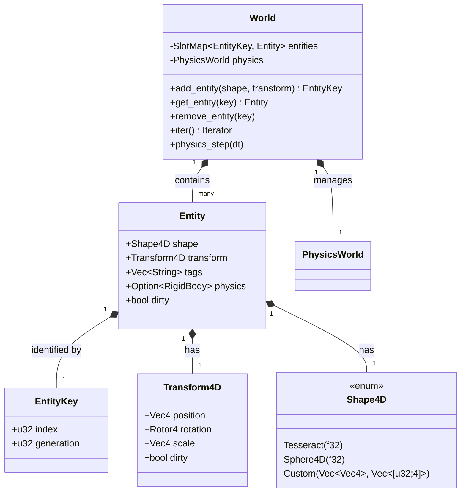
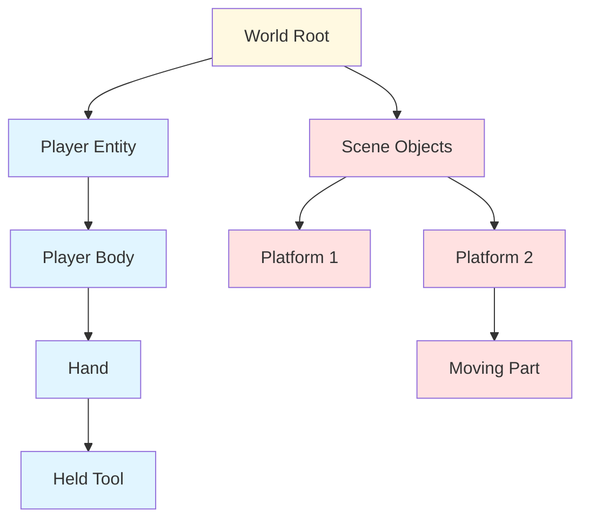

# Phase 3: Documentation

**Created:** 2026-01-27
**Status:** Ready
**Priority:** P2
**Estimated Effort:** 4-5 sessions
**Dependencies:** None (can run in parallel with other phases)

---

## Overview

Phase 3 establishes comprehensive user-facing and contributor-facing documentation for Rust4D. Currently, the codebase has strong internal documentation (doc comments) but lacks external resources for users and contributors to understand and use the engine effectively.

This phase transforms Rust4D from "well-documented code" to "well-documented project" by adding examples, guides, and architectural documentation.

### Goals

1. **Lower barrier to entry** for new users with runnable examples
2. **Provide clear onboarding** with getting started guides
3. **Document architecture** with diagrams showing system relationships
4. **Enable contribution** with developer-facing documentation
5. **Improve discoverability** with enhanced README and structure

### Non-Goals

- API documentation generation/hosting (use `cargo doc` for now)
- Video tutorials (requires Willow's involvement)
- Interactive documentation website (future consideration)
- Contribution guidelines (CONTRIBUTING.md) - defer to Phase 4

---

## Phase Structure

### Phase 3A: Quick Wins (2 sessions)

High-impact documentation that can be completed quickly:
- Examples directory with 3-4 runnable examples
- Enhanced README with project status and 4D explanation
- ARCHITECTURE.md with Mermaid diagrams

### Phase 3B: Comprehensive Guides (2-3 sessions)

In-depth documentation for users and developers:
- Getting Started guide
- User Guide (comprehensive manual)
- Developer Guide (internals and contribution guide)

---

## Phase 3A: Quick Wins

**Effort:** 2 sessions
**Can run in parallel with:** Phase 2 (Scene Management), Phase 4 (Architecture)

### Task Breakdown

#### Task 3A.1: Create Examples Directory (1 session)

Create `examples/` directory with 3-4 standalone examples demonstrating engine usage.

**Examples to Create:**

1. **`01_hello_tesseract.rs`** - Minimal example (30-50 lines)
   - Render a single tesseract
   - Fixed camera (no controls)
   - Demonstrates: World, Entity, Transform4D, basic rendering
   - Should be the simplest possible working example

2. **`02_multiple_shapes.rs`** - Multiple objects (60-80 lines)
   - Render 3-5 different 4D shapes
   - Basic camera controls
   - Different colors/materials per shape
   - Demonstrates: Multiple entities, transforms, basic scene composition

3. **`03_physics_demo.rs`** - Physics simulation (80-100 lines)
   - Falling/bouncing objects
   - Floor collision
   - Demonstrates: PhysicsWorld, RigidBody, PhysicsMaterial, collision
   - Shows how physics integrates with rendering

4. **`04_camera_exploration.rs`** - Camera controls (70-90 lines)
   - Scene with multiple objects to navigate
   - Full 4D camera controls (WASD, QE, rotation through W)
   - Demonstrates: Camera4D, CameraController, 4D navigation

5. **`examples/README.md`** - Example index
   - Table listing each example with description
   - How to run examples (`cargo run --example <name>`)
   - Suggested learning order

**Requirements:**
- Each example MUST compile and run successfully
- Each example MUST include inline comments explaining key concepts
- Examples should progressively increase in complexity
- Examples should be self-contained (no external dependencies beyond crates)
- Test all examples: `cargo build --examples && cargo run --example 01_hello_tesseract`

**Files to Create:**
```
examples/
├── 01_hello_tesseract.rs
├── 02_multiple_shapes.rs
├── 03_physics_demo.rs
├── 04_camera_exploration.rs
└── README.md
```

**Commit Strategy:**
- Commit 1: "Add examples directory and README"
- Commit 2: "Add 01_hello_tesseract example"
- Commit 3: "Add 02_multiple_shapes example"
- Commit 4: "Add 03_physics_demo example"
- Commit 5: "Add 04_camera_exploration example"

---

#### Task 3A.2: Enhanced README.md (0.5 sessions)

Expand the current README from 41 lines to ~150-200 lines with better structure and content.

**Sections to Add/Enhance:**

1. **Project Status** (new section)
   - Current version (0.1.0-alpha or similar)
   - What works (rendering, physics, camera controls)
   - What's in progress (scene system, configuration)
   - What's planned (see roadmap)

2. **What is 4D Rendering?** (new section)
   - Brief explanation of 4D space for general audiences
   - Analogy: "Like a 3D cross-section is to 4D what a 2D shadow is to 3D"
   - Link to further reading (4D primer document when created)

3. **Features** (new section)
   - Real-time 4D rendering via marching tetrahedra
   - 4D physics simulation with collision detection
   - Intuitive camera controls for 4D navigation
   - Support for custom 4D shapes and scenes

4. **Architecture Overview** (new section)
   - Brief description of the 5 crates
   - Link to ARCHITECTURE.md
   - High-level data flow diagram (ASCII or link to Mermaid)

5. **Enhanced Building & Running** (expand existing)
   - Prerequisites (Rust version, GPU requirements)
   - How to run examples
   - How to generate documentation (`cargo doc --open`)
   - Troubleshooting section (common issues)

6. **Examples** (new section)
   - Link to `examples/` directory
   - Brief mention of what examples demonstrate

7. **Documentation** (new section)
   - Link to getting started guide
   - Link to user guide
   - Link to developer guide
   - Link to API documentation

8. **Enhanced Inspiration** (expand existing)
   - Keep existing links
   - Add brief description of what inspired each aspect
   - Add "differences from Engine4D" note

9. **Contributing** (new section)
   - Note about project status (early development)
   - Link to CLAUDE.md for development workflow
   - Link to issues/discussions when applicable

**Visual Enhancement:**
- Consider adding ASCII art logo if appropriate
- Consider adding screenshot/GIF (requires Willow to capture)
- Use clear section headers and formatting

**Requirements:**
- Markdown must be well-formatted and render correctly on GitHub
- Links must be relative paths where possible
- Tone should be welcoming and accessible

**Commit Strategy:**
- Single commit: "Enhance README with architecture, status, and 4D explanation"

---

#### Task 3A.3: Create ARCHITECTURE.md (0.5 sessions)

Create a comprehensive architecture document with Mermaid diagrams explaining system design.

**Document Structure:**

1. **Introduction**
   - Purpose of this document
   - Intended audience (contributors, curious users)
   - How to navigate this document

2. **High-Level Overview**
   - What Rust4D does (4D rendering pipeline)
   - Key design principles (performance, modularity, clarity)
   - Technology stack (Rust, wgpu, winit)

3. **Crate Architecture**
   - Description of each crate and its responsibilities
   - Crate dependency diagram (Mermaid)
   - Why the crates are organized this way

4. **Data Flow**
   - How data flows through the system
   - World → Physics → Rendering pipeline
   - Data flow diagram (Mermaid)

5. **Key Subsystems**
   - Entity management (generational keys)
   - Transform system (hierarchical transforms)
   - Physics integration (collision, response)
   - Rendering pipeline (4D → 3D slicing → rasterization)

6. **Design Decisions**
   - Why not ECS? (deferred for simplicity)
   - Why marching tetrahedra? (Engine4D compatibility)
   - Why RON for scenes? (Rust-native, expressive)
   - Dirty tracking strategy

7. **Performance Considerations**
   - GPU upload strategies
   - Dirty tracking to minimize updates
   - Future optimization opportunities

8. **Future Architecture**
   - Potential migration paths (ECS, scene graph)
   - Plugin system considerations
   - Scripting integration points

**Mermaid Diagrams to Include:**

See "Mermaid Diagram Templates" section below for full diagram code.

1. **Crate Dependency Graph** - Shows how crates depend on each other
2. **Data Flow Diagram** - Shows how data moves through the engine
3. **Rendering Pipeline** - Shows 4D → 3D → 2D transformation stages
4. **Physics Integration** - Shows physics update cycle

**Requirements:**
- All Mermaid diagrams MUST render correctly on GitHub
- Diagrams should be clear and well-labeled
- Document should be ~500-800 lines including diagrams
- Use clear language avoiding unnecessary jargon

**Commit Strategy:**
- Single commit: "Add ARCHITECTURE.md with system diagrams"

---

### Success Criteria for Phase 3A

- [ ] Examples directory exists with 4 working examples + README
- [ ] All examples compile and run without errors
- [ ] README.md expanded to ~150-200 lines with new sections
- [ ] ARCHITECTURE.md created with 4+ Mermaid diagrams
- [ ] All Mermaid diagrams render correctly on GitHub
- [ ] Documentation is clear, accurate, and well-formatted

---

## Phase 3B: Comprehensive Guides

**Effort:** 2-3 sessions
**Can run in parallel with:** Phase 4B (Error Handling)
**Dependencies:** Phase 3A should complete first (for context and examples to reference)

### Task Breakdown

#### Task 3B.1: Getting Started Guide (1 session)

Create `docs/getting-started.md` - comprehensive onboarding for new users.

**Document Structure:**

1. **Introduction**
   - What is Rust4D?
   - What will you learn in this guide?
   - Prerequisites (Rust knowledge, 3D graphics basics helpful but not required)

2. **Installation**
   - Installing Rust (via rustup)
   - Cloning the repository
   - Verifying your environment
   - GPU requirements and driver setup

3. **Building and Running**
   - `cargo run --release` walkthrough
   - What you should see (describe the demo scene)
   - Controls overview (reference README table)
   - Troubleshooting build/runtime errors

4. **Understanding 4D Space**
   - What is the 4th dimension?
   - How 4D rendering works (3D hyperplane slicing)
   - Analogy: 2D flatland seeing 3D objects
   - Visualizing tesseracts and other 4D shapes
   - Understanding W-axis movement

5. **Running the Examples**
   - Overview of available examples
   - How to run: `cargo run --example <name>`
   - Walkthrough of `01_hello_tesseract.rs`
   - Explanation of what the code does

6. **Your First 4D Scene**
   - Step-by-step tutorial creating a simple scene
   - Creating a World
   - Adding entities with Transform4D
   - Setting up the camera
   - Running the scene
   - Code walkthrough with explanations

7. **Next Steps**
   - Read the User Guide for comprehensive documentation
   - Explore more examples
   - Experiment with the physics demo
   - Join discussions (if applicable)
   - Link to Developer Guide for contributors

**Tone and Style:**
- Welcoming and beginner-friendly
- Assume reader knows Rust basics but not 4D concepts
- Use clear examples and analogies
- Include code snippets with explanations

**Requirements:**
- Document should be ~400-600 lines
- All code examples MUST compile
- Include links to relevant API documentation
- Clear section headers and navigation

**Commit Strategy:**
- Single commit: "Add getting started guide (Phase 3B)"

---

#### Task 3B.2: User Guide (1-1.5 sessions)

Create `docs/user-guide.md` - comprehensive manual for using Rust4D.

**Document Structure:**

1. **Introduction**
   - Purpose of this guide
   - How to navigate (table of contents)
   - Prerequisites (assumes you've completed Getting Started)

2. **Understanding 4D Space** (expanded from getting started)
   - Coordinate systems (X, Y, Z, W axes)
   - 4D rotations and their properties
   - Common 4D shapes (tesseract, spherinder, duocylinder, etc.)
   - Visualizing 4D movement

3. **Core Concepts**
   - World: The container for all entities
   - Entity: Objects in your 4D scene
   - Transform4D: Position, rotation, scale in 4D
   - Tags: Organizing and querying entities

4. **Creating Entities**
   - Adding shapes to the world
   - Built-in shape generators (tesseract, sphere4d, etc.)
   - Custom geometry (defining vertices and tetrahedra)
   - Entity lifecycle

5. **Transforms and Rotations**
   - Setting position, rotation, scale
   - Understanding Rotor4 (4D rotations)
   - Common rotation operations
   - Transform hierarchies (when implemented)

6. **Physics System**
   - Enabling physics on entities
   - RigidBody properties (velocity, angular velocity, mass)
   - PhysicsMaterial (friction, restitution)
   - Collision detection and response
   - Physics constraints (when implemented)

7. **Camera and Navigation**
   - Camera4D properties
   - CameraController usage
   - Movement in 4D space (WASD, QE, Space/Shift)
   - Rotation controls (mouse look, W-rotation)
   - Camera projection and slicing

8. **Rendering and Visuals**
   - How the rendering pipeline works
   - SliceParams and camera slicing
   - Materials and colors
   - Custom coloring functions
   - Performance considerations

9. **Scene Building**
   - SceneBuilder API (when implemented in Phase 2)
   - Loading scenes from files (when implemented)
   - Scene composition patterns
   - Scene hierarchy best practices

10. **Advanced Topics**
    - Custom shape generators
    - Procedural geometry
    - Physics tuning
    - Performance optimization tips

11. **API Reference Overview**
    - Quick reference to key types
    - Links to generated rustdoc
    - Common patterns and idioms

**Tone and Style:**
- Technical but accessible
- Reference manual style with practical examples
- Code snippets for each concept
- Clear explanations of "why" not just "how"

**Requirements:**
- Document should be ~800-1200 lines
- Comprehensive coverage of all user-facing features
- All code examples MUST compile
- Well-organized with clear table of contents
- Include Mermaid diagrams where helpful

**Commit Strategy:**
- Single commit: "Add comprehensive user guide (Phase 3B)"

---

#### Task 3B.3: Developer Guide (1 session)

Create `docs/developer-guide.md` - internals documentation for contributors.

**Document Structure:**

1. **Introduction**
   - Who this guide is for (contributors, curious developers)
   - What you'll learn (architecture, internals, contribution workflow)
   - Prerequisites (assumes familiarity with Rust)

2. **Project Structure**
   - Repository layout
   - Crate organization
   - Build system (Cargo workspace)
   - Testing structure
   - Documentation locations

3. **Development Environment**
   - Setting up for development
   - Recommended tools (rust-analyzer, IDE setup)
   - Running tests (`cargo test`)
   - Generating documentation (`cargo doc`)
   - Debugging tips

4. **Architecture Deep Dive**
   - Reference ARCHITECTURE.md
   - Implementation details for each subsystem
   - Code organization principles
   - Module structure rationale

5. **Core Systems**

   **5.1 Entity System**
   - Generational key implementation
   - SlotMap usage and rationale
   - Entity creation and deletion
   - Query patterns

   **5.2 Transform System**
   - Transform4D implementation
   - Dirty tracking mechanism
   - Update propagation
   - Future: Transform hierarchies

   **5.3 Physics System**
   - Integration with rendering
   - Collision detection algorithm
   - Collision response calculation
   - PhysicsWorld vs World separation

   **5.4 Rendering Pipeline**
   - 4D → 3D slicing (marching tetrahedra)
   - GPU buffer management
   - Vertex/index buffer generation
   - Shader pipeline
   - Dirty tracking for GPU updates

6. **Key Algorithms**
   - Marching tetrahedra slicing
   - 4D rotation math (Rotor4)
   - Collision detection (SAT, GJK notes)
   - Transform propagation

7. **Code Conventions**
   - Naming conventions
   - Documentation standards
   - Testing requirements
   - Error handling patterns

8. **Testing Strategy**
   - Unit tests per module
   - Integration tests
   - Test coverage expectations
   - How to write good tests

9. **Performance Considerations**
   - Hot paths in the rendering pipeline
   - Allocation strategies
   - GPU upload optimization
   - Profiling techniques

10. **Contributing Guidelines**
    - Git workflow (feature branches)
    - Commit message format (reference CLAUDE.md)
    - Pull request process
    - Code review expectations

11. **Future Architecture**
    - ECS migration path
    - Scene graph implementation
    - Plugin system design
    - Scripting integration points

12. **Common Tasks**
    - Adding a new shape generator
    - Adding a physics feature
    - Adding a rendering feature
    - Modifying the shader pipeline

**Tone and Style:**
- Technical and detailed
- Assumes Rust proficiency
- Focus on "why" behind design decisions
- Include implementation notes and gotchas

**Requirements:**
- Document should be ~800-1000 lines
- Comprehensive coverage of internals
- Code examples for common contribution tasks
- Diagrams explaining complex algorithms
- Clear contribution workflow

**Commit Strategy:**
- Single commit: "Add developer guide (Phase 3B)"

---

#### Task 3B.4: Create docs/README.md (0.25 sessions)

Create index page for the docs directory.

**Content:**
- Welcome to Rust4D documentation
- Navigation to all guides
- Quick links to:
  - Getting Started → `getting-started.md`
  - User Guide → `user-guide.md`
  - Developer Guide → `developer-guide.md`
  - Architecture → `../ARCHITECTURE.md`
  - API Reference → generated rustdoc
  - Examples → `../examples/`

**Commit Strategy:**
- Bundle with final Phase 3B commit or separate: "Add docs index page"

---

### Success Criteria for Phase 3B

- [ ] Getting Started guide created (~400-600 lines)
- [ ] User Guide created (~800-1200 lines)
- [ ] Developer Guide created (~800-1000 lines)
- [ ] docs/README.md index created
- [ ] All guides are well-formatted and comprehensive
- [ ] All code examples compile and run
- [ ] Guides link to each other appropriately
- [ ] Clear navigation structure established

---

## Files to Create

### Phase 3A Files
```
examples/
├── 01_hello_tesseract.rs          # Minimal example
├── 02_multiple_shapes.rs          # Multiple objects
├── 03_physics_demo.rs             # Physics simulation
├── 04_camera_exploration.rs       # Camera controls
└── README.md                      # Example index

ARCHITECTURE.md                    # Architecture documentation with diagrams
README.md (modified)               # Enhanced project README
```

### Phase 3B Files
```
docs/
├── README.md                      # Documentation index
├── getting-started.md             # New user onboarding
├── user-guide.md                  # Comprehensive manual
└── developer-guide.md             # Internals and contribution guide
```

---

## Mermaid Diagram Templates

### 1. Crate Dependency Graph



**Caption:** Crate dependency graph showing how the five crates relate to each other. `rust4d_math` provides foundational 4D math types used by all other crates.

---

### 2. Data Flow Diagram



**Caption:** High-level data flow showing how user input flows through the engine to produce rendered output. The physics system updates the world state, which is then sliced and rendered.

---

### 3. Rendering Pipeline Detail



**Caption:** Detailed rendering pipeline showing the transformation from 4D geometry to 2D screen output through slicing and rasterization stages.

---

### 4. Physics Integration Cycle



**Caption:** Sequence diagram showing how physics updates integrate with the world and rendering system each frame.

---

### 5. Entity Management Architecture



**Caption:** Class diagram showing the entity management architecture. World uses generational keys to safely reference entities.

---

### 6. Transform Hierarchy (Future)



**Caption:** Example transform hierarchy (future feature). Children inherit parent transforms, enabling complex articulated structures.

---

## Test Requirements

### Examples Testing

All examples MUST be tested before completion:

```bash
# Build all examples
cargo build --examples

# Run each example to verify it works
cargo run --example 01_hello_tesseract
cargo run --example 02_multiple_shapes
cargo run --example 03_physics_demo
cargo run --example 04_camera_exploration
```

Expected behavior:
- Each example launches without errors
- Window appears with rendered content
- Controls work as documented
- No panics or crashes during normal use

### Documentation Testing

- All Mermaid diagrams MUST render correctly on GitHub
  - Push to a test branch and verify rendering
  - Use GitHub's Mermaid preview in VSCode if available
- All code snippets in guides MUST compile
  - Extract code snippets and test them
  - Or use doc tests where applicable
- All links MUST resolve correctly
  - Test relative links to other documents
  - Test links to API documentation

### Code Example Verification

For guides with code examples:
- Create a temporary `docs/examples/` directory
- Extract code snippets into separate files
- Verify they compile: `cargo build`
- Remove temporary directory after verification

---

## Success Criteria Summary

### Phase 3A Success Criteria
- [ ] 4 working examples in `examples/` directory
- [ ] Examples README with clear index
- [ ] All examples compile and run successfully
- [ ] README.md expanded with 6+ new sections
- [ ] ARCHITECTURE.md created with 4+ Mermaid diagrams
- [ ] All diagrams render correctly on GitHub
- [ ] Documentation is clear, accurate, well-formatted

### Phase 3B Success Criteria
- [ ] Getting Started guide created and comprehensive
- [ ] User Guide created covering all user-facing features
- [ ] Developer Guide created with architecture deep dive
- [ ] docs/README.md index page created
- [ ] All guides well-formatted with clear navigation
- [ ] All code examples compile and run
- [ ] Guides link to each other appropriately

### Overall Phase 3 Success Criteria
- [ ] Project has comprehensive external documentation
- [ ] New users can onboard via Getting Started
- [ ] Users can reference comprehensive User Guide
- [ ] Contributors can understand internals via Developer Guide
- [ ] Architecture is documented with visual diagrams
- [ ] Examples demonstrate all major features
- [ ] Documentation is discoverable and well-organized

---

## Parallelization Strategy

### Phase 3A Parallelization

**Wave 3A (2 agents, parallel):**

Agent 1: Examples & README
- Task 3A.1: Create examples directory (1 session)
- Task 3A.2: Enhance README (0.5 sessions)

Agent 2: Architecture Documentation
- Task 3A.3: Create ARCHITECTURE.md (0.5 sessions)
- Can start immediately, no dependencies

**Total Wave 3A Time:** 1.5 sessions (parallel) vs 2 sessions (sequential)

### Phase 3B Parallelization

**Wave 3B (2-3 agents, parallel):**

Agent 1: Getting Started
- Task 3B.1: Getting started guide (1 session)

Agent 2: User Guide
- Task 3B.2: User guide (1-1.5 sessions)

Agent 3: Developer Guide
- Task 3B.3: Developer guide (1 session)
- Task 3B.4: docs/README.md (0.25 sessions)

**Total Wave 3B Time:** 1.5 sessions (parallel) vs 3 sessions (sequential)

### Phase 3 Parallel Execution with Other Phases

Phase 3 can run COMPLETELY IN PARALLEL with:
- Phase 2 (Scene Management) - no dependencies
- Phase 4 (Architecture refactoring) - documentation benefits from code cleanup but not required

Suggested parallel execution:
```
Session 1-2:
├── Phase 3A Agent: Examples & README
└── Phase 2A Agent: Scene serialization

Session 3-4:
├── Phase 3B Agent 1: Getting Started
├── Phase 3B Agent 2: User Guide
└── Phase 2B Agent: Prefab system

Session 5:
└── Phase 3B Agent 3: Developer Guide
```

---

## Notes for Implementation

### Writing Style Guidelines

**For All Documentation:**
- Use active voice ("The engine renders..." not "Rendering is done...")
- Be concise but complete
- Use examples liberally
- Link between related documents
- Include table of contents for long documents
- Use clear section headers

**For Examples:**
- Start with minimal setup
- Progress from simple to complex
- Include inline comments explaining key concepts
- Keep examples focused on one concept each
- Make examples runnable with `cargo run --example <name>`

**For Guides:**
- Assume reader knowledge level appropriate for guide type
- Getting Started: Beginner-friendly, minimal assumed knowledge
- User Guide: Assumes basic Rust, no 4D knowledge needed
- Developer Guide: Assumes Rust proficiency and engine familiarity

### Diagram Guidelines

**For Mermaid Diagrams:**
- Test rendering on GitHub before finalizing
- Use clear labels and legends
- Include captions explaining the diagram
- Use color coding consistently
- Keep diagrams simple and focused
- Maximum 15-20 nodes per diagram

### Review Process

Before marking Phase 3 complete:
1. Review all documentation for clarity
2. Test all examples
3. Verify all links work
4. Check all diagrams render
5. Proofread for typos and formatting
6. Ensure consistent terminology throughout
7. Get feedback if possible (from Willow or test readers)

---

## Future Documentation Enhancements

These are OUT OF SCOPE for Phase 3 but noted for future consideration:

### Phase 3C: API Documentation Enhancement (deferred)
- Add `# Examples` sections to all public functions
- Enhance crate-level documentation in lib.rs files
- Add usage examples to module documentation
- Set up rustdoc generation and hosting

### Phase 3D: Advanced Documentation (deferred)
- 4D Mathematics Primer (detailed math explanations)
- Algorithm deep dives (marching tetrahedra, collision detection)
- Performance profiling guide
- Shader programming guide
- Video tutorials (requires Willow)

### Phase 3E: Community Documentation (deferred)
- CONTRIBUTING.md
- CODE_OF_CONDUCT.md
- Issue templates
- Pull request templates
- CHANGELOG.md
- Release notes process

---

## Dependencies and Blockers

### Dependencies
- **None** - Phase 3 can start immediately
- Phase 3B benefits from Phase 3A being complete (for context)
- Developer Guide benefits from Phase 4 architecture cleanup (but not required)

### Blockers
- **None currently**

### What This Phase Blocks
- **Nothing** - Documentation is parallel to development
- However, good documentation helps with:
  - Phase 2 implementation (examples inform API design)
  - Phase 5 feature development (user guide shows current capabilities)
  - Future contributor onboarding

---

## Estimated Timeline

### Sequential Execution
- Phase 3A: 2 sessions
- Phase 3B: 2-3 sessions
- **Total: 4-5 sessions**

### Parallel Execution (Recommended)
- Wave 3A (2 agents): 1.5 sessions
- Wave 3B (3 agents): 1.5 sessions
- **Total: 3 sessions** (with multi-agent parallelization)

### Integration with Overall Roadmap

If running in parallel with Phases 2 and 4:
```
Session 1-2:  Phase 1 (Foundation) - SEQUENTIAL
Session 3-4:  Phase 2 + Phase 3A - PARALLEL
Session 5-6:  Phase 2B + Phase 3B + Phase 4 - PARALLEL
Session 7+:   Phase 5 (Advanced Features)

Total: Documentation adds 0 sessions to critical path when parallelized
```

---

## Open Questions

1. **Screenshots/GIFs:** Should we wait for Willow to capture visuals before finalizing README?
   - **Resolution:** Add placeholder in README, update later with visuals

2. **API documentation hosting:** Should we set up GitHub Pages now or defer?
   - **Resolution:** Defer to future phase, use local `cargo doc` for now

3. **Code examples in User Guide:** How detailed should they be?
   - **Resolution:** Focus on concepts, link to full examples in `examples/` directory

4. **Developer Guide vs CONTRIBUTING.md:** Should we split these?
   - **Resolution:** Developer Guide includes contribution guidelines for Phase 3, extract to CONTRIBUTING.md in Phase 4 if needed

5. **4D Math Primer:** Should this be a separate document?
   - **Resolution:** Brief explanation in Getting Started, defer comprehensive primer to future phase

---

## Phase 3 Complete When

- [ ] All Phase 3A tasks complete
- [ ] All Phase 3B tasks complete
- [ ] All success criteria met
- [ ] All tests passing (examples run, diagrams render, links work)
- [ ] Documentation reviewed for quality and accuracy
- [ ] Session report written documenting the work

**Definition of Done:** A new user can clone the repository, read the Getting Started guide, run the examples, and understand how to use the engine. A contributor can read the Developer Guide and understand the architecture well enough to make meaningful contributions.

---

**Plan prepared by:** Claude Code
**Date:** 2026-01-27
**Status:** Ready for implementation
